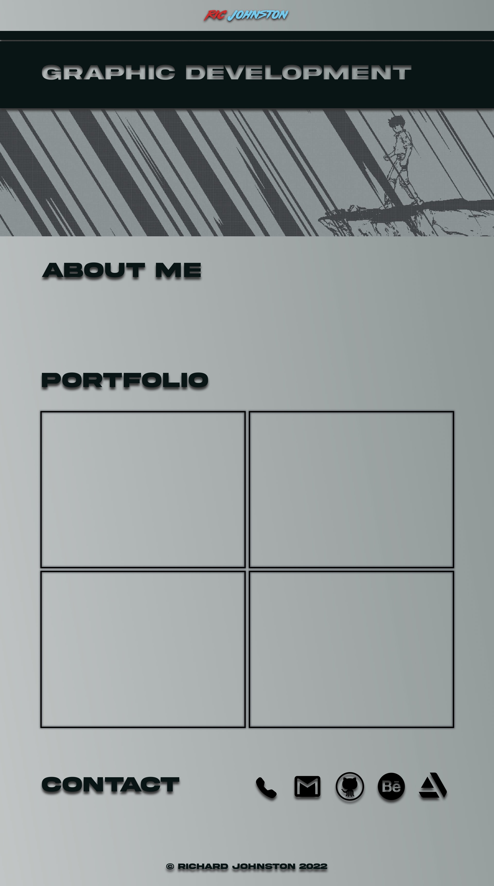
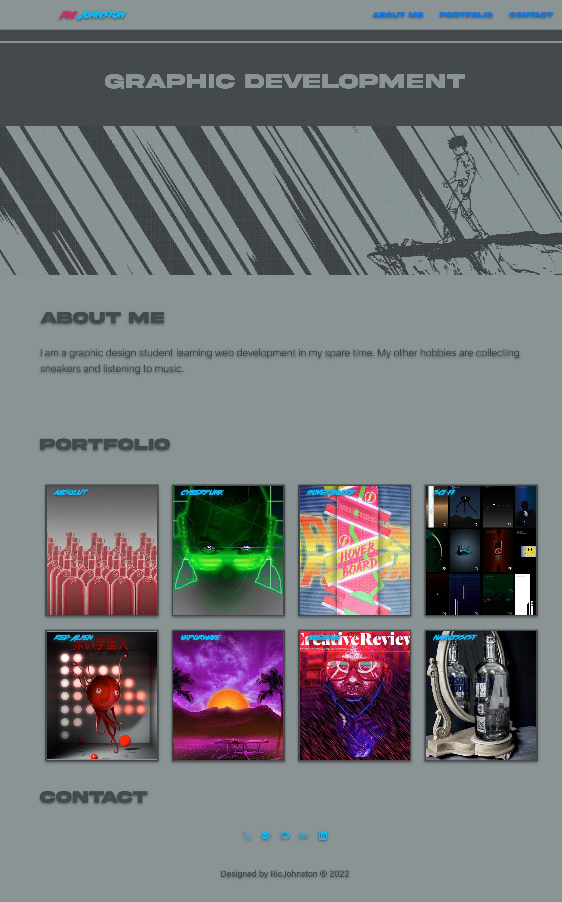

# bootstrap-portfolio

The third week challenge

## Description

A custom portfolio site using bootstrap.

## Process

I rebuilt my portfolio website using the Bootstrap CSS Framework.

First of all I decided to draft a design in figma before attempting to recreate the same look using html, css, and bootstrap.

I have included custom demo fonts and images of my previous illustrations and projects. I am quite satisfied with the result.

